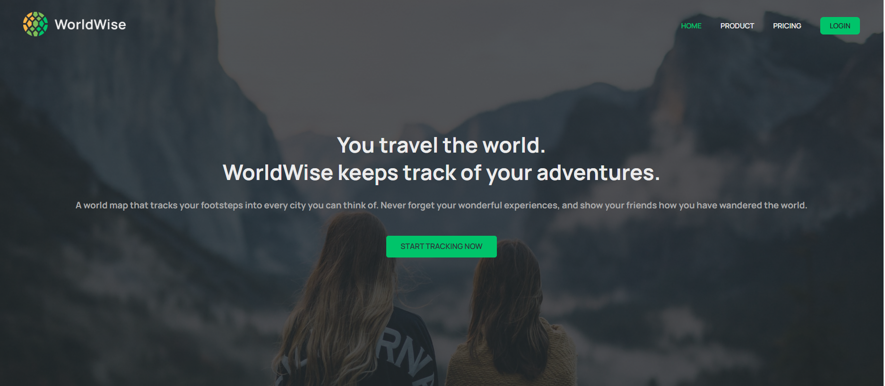
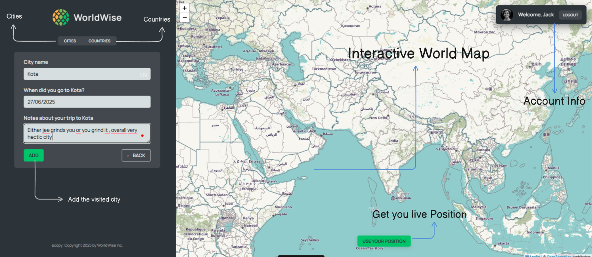

# 🌍 WorldWise

A modern travel tracking application that helps you keep track of all the places you've visited around the world. Click on an interactive map to mark cities, add personal notes, and build your own travel diary.

## 🚀 Live Demo

**[🔗 View Live App]((https://odysseyarchive.netlify.app/))**

*Try the app live and start tracking your travels!*

## ✨ Features

- **Interactive World Map**: Click anywhere on the map to add a new city to your travel log
- **Travel Timeline**: View all your visited cities with dates and personal notes
- **City Details**: Add detailed information about each location including:
  - Visit date
  - Personal notes and memories
  - Country and city information
- **Geolocation**: Use your current location to quickly add nearby cities
- **Responsive Design**: Works seamlessly on desktop and mobile devices
- **Data Persistence**: Your travel data is saved locally using JSON Server

## 🛠️ Tech Stack

- **Frontend**: React 18 with modern hooks
- **Build Tool**: Vite for fast development and building
- **Routing**: React Router DOM v6 for navigation
- **Maps**: Leaflet & React-Leaflet for interactive mapping
- **Date Handling**: React DatePicker for date selection
- **Backend**: JSON Server for local data storage
- **Styling**: CSS Modules (assumed based on typical setup)
- **Linting**: ESLint with React-specific rules

## 🚀 Getting Started

### Prerequisites

- Node.js (version 16 or higher)
- npm or yarn package manager

### Installation

1. **Clone the repository**
   ```bash
   git clone https://github.com/lilcodo69/The.git
   cd worldwise
   ```

2. **Install dependencies**
   ```bash
   npm install
   ```

3. **Start the JSON Server (Backend)**
   ```bash
   npm run server
   ```
   This will start the JSON server on `http://localhost:9000`

4. **Start the development server**
   ```bash
   npm run dev
   ```
   The app will be available at `http://localhost:5173`

## 📝 Available Scripts

- `npm run dev` - Start the development server
- `npm run build` - Build the app for production
- `npm run preview` - Preview the production build locally
- `npm run server` - Start the JSON Server backend
- `npm run lint` - Run ESLint to check code quality

## 🗂️ Project Structure

```
worldwiseagain/
├── .vscode/           # VS Code configuration
├── check/             # Testing/check files
├── node_modules/      # Dependencies
├── public/            # Static assets
├── src/
│   ├── components/    # Reusable UI components
│   ├── contexts/      # React Context providers  
│   ├── data/          # JSON data files (cities.json)
│   ├── hooks/         # Custom React hooks
│   ├── Pages/         # Page components
│   ├── App.jsx        # Main App component
│   ├── index.css      # Global styles
│   ├── main.jsx       # React entry point
│   └── PageNotFound.jsx # 404 error page
├── .eslintrc.json     # ESLint configuration
├── .gitignore         # Git ignore rules
├── chk.txt           # Additional notes/checks
├── index.html         # HTML template
├── notes             # Development notes
├── package-lock.json  # Locked dependency versions
├── package.json       # Project dependencies and scripts
├── README.md          # Project documentation
└── vite.config.js     # Vite configuration
```

## 🎯 How to Use

1. **Explore the Map**: Navigate around the interactive world map
2. **Add a City**: Click on any location to add it to your travel log
3. **Fill Details**: Add the date of your visit and personal notes
4. **View Your Travels**: Check your travel list to see all visited places
5. **Edit or Delete**: Manage your travel entries as needed

## 🌐 API Endpoints

The JSON Server provides the following endpoints:

- `GET /cities` - Get all cities
- `POST /cities` - Add a new city
- `GET /cities/:id` - Get a specific city
- `PUT /cities/:id` - Update a city
- `DELETE /cities/:id` - Delete a city

## 🤝 Contributing

1. Fork the repository
2. Create your feature branch (`git checkout -b feature/amazing-feature`)
3. Commit your changes (`git commit -m 'Add some amazing feature'`)
4. Push to the branch (`git push origin feature/amazing-feature`)
5. Open a Pull Request

## 📸 Screenshots

### 🗺️ 

*Click anywhere on the map to add a new travel destination*

### 📋 Travel Log && Interactive World Map

*View all your visited cities with dates and notes*
*Click anywhere on the map to add a new travel destination*


## 🔮 Future Enhancements

- [ ] User authentication and profiles
- [ ] Cloud data synchronization
- [ ] Photo uploads for each location
- [ ] Travel statistics and analytics
- [ ] Social sharing features
- [ ] Offline support with PWA
- [ ] Import/Export travel data

## 📄 License

This project is open source and available under the [MIT License](LICENSE).

## 🙏 Acknowledgments

- Built following Jonas Schmedtmann's React course
- Map data provided by [OpenStreetMap](https://www.openstreetmap.org/)
- Icons and UI inspiration from various travel apps

---

**Happy Travels!** 🧳✈️

*Start tracking your adventures and build your personal travel story with WorldWise.*
